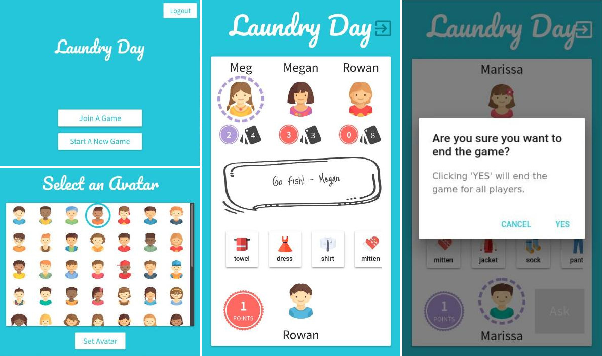

# Laundry Day

"Laundry Day" is a novel re-skin of the traditional kid’s card game "Go Fish." The game has been a staple for practicing memorization and listening with young children for generations and Laundry Day will continue this tradition. Phones and tablets are becoming even more ubiquitous than packs of cards and we hope to facilitate access to this age old game.

This website would be utilized by children and their parents, to play games casually with each other. Children need a user interface that is self-evident or at minimum self-explanatory because they may have limited language skills and may struggle understand written instructions in the application.

## Setup

### Requirements

- Node 8.11.+
- NPM (installed automatically with node in most cases)

### Building

`$ git clone ​ https://github.com/nicoleloison/513project`  
`$ cd 513project`  
`$ git checkout --track origin/develop`  
`$ npm install`  
`$ npm run build`

### Running

`$ npm run r_server`  
Go to ​http://localhost:3001​ to see the app.
